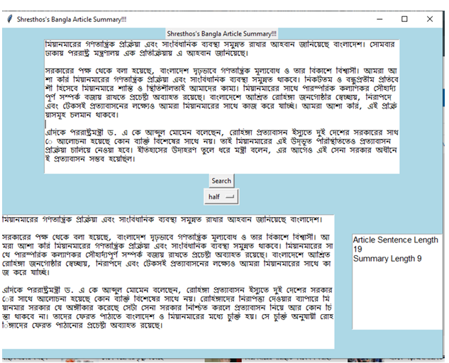
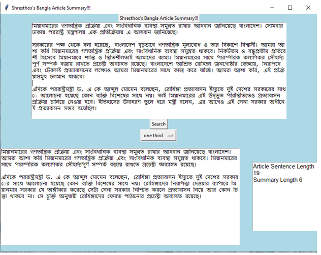

# 📰 Bangla Article Summary using Sentence Ranking

This project implements an **extractive summarization** system for Bangla news articles using **sentence ranking** techniques from scratch — **no external NLP libraries used**.

---

## ✨ Key Features

- ✅ Clean, preprocess Bangla articles (punctuation, duplicates, stopwords, stemming)
- ✅ Sentence ranking using term frequency (TF)
- ✅ Extractive summarization with top-N sentence selection
- ✅ Built 100% from scratch — pure Python

---

## 📌 Dataset

We scraped over **53,000 articles** from **The Daily Ittefaq** covering:
- 📰 National, World, Politics, Education, Covid-19, Cricket, etc.
- 🗃️ ~900,000 sentences, ~24M trigrams

### 🔢 Sample Statistics:
| Metric | Value |
|--------|-------|
| Total Articles | 53,571 |
| Unique Unigrams | 252,073 |
| Total Trigrams | 24,030,358 |
| Categories | 22 |

---

## 🧠 Methodology

### 1. Preprocessing
- Bangla punctuation & Unicode cleaning
- Duplicate sentence removal
- Frequency-based stopword removal
- Light rule-based stemming
- Short article filtering

### 2. Sentence Ranking
- Calculate term frequency (TF)
- Score each sentence based on important words
- Select top-N ranked sentences for summary

---

## 🖼️ Screenshots

